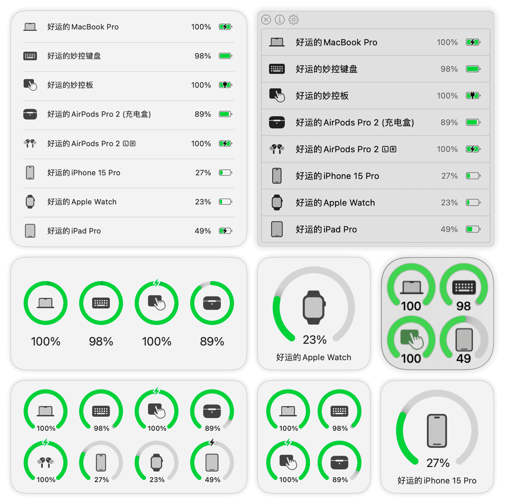

# 
<p align="center">

<h1 align="center">AirBattery</h1>
<h3 align="center">Get battery usage of all devices on Mac and show them on the Dock / StatusBar / Widgets!<br><a href="./README_zh.md">[中文版本]</a><br><a href="https://lihaoyun6.github.io/airbattery/">[Landing Page]</a></h3> 
</p>

## Screenshots
<p align="center">
<picture>
  <source media="(prefers-color-scheme: dark)" srcset="./img/preview_dark.png">
  <source media="(prefers-color-scheme: light)" srcset="./img/preview.png">
  
</picture>
</p>

## Installation and Usage
### System Requirements:
- macOS 11.0 and Later  

### Installation:
Download the latest installation file [here](../../releases/latest) or install via Homebrew:  

```bash
brew install lihaoyun6/tap/airbattery
```

### Usage: 
- After AirBattery is started, it will be displayed on both the Dock and the status bar by default, or only one of them (can be configured)  

- AirBattery will automatically search for all devices supported by the **"Nearbility Engine"** without manual configuration.  
- Click the Dock icon / status bar icon, or add a widget to view the battery usage of your devices.  
- You can also use the **"Nearcast"** feature to check the battery usage of other Macs and their peripherals in the LAN at any time.  
- You can also change the status bar icon to a real-time battery icon in preferences, just like the one that comes with the system.  
- If necessary, you can hide certain devices in the Dock menu or status bar menu, and unhide them at any time.  

## Supported Devices
<!-- SUPPORTED_DEVICES:START -->
You can list supported categories and Apple/Beats model codes from your Mac:

- Run `airbattery supported` to print a Markdown list.
- Add `--now` to mark categories currently enabled by your settings.
- Add `--json` to get machine-readable JSON.

This section can be auto-generated from the CLI to avoid documentation drift.
<!-- SUPPORTED_DEVICES:END -->

## Q&A
**1. Why is my iPhone / iPad / Apple Watch not showing up?**
> Please make sure the iPhone / iPad has trusted this Mac ***(and connected the Mac with a data cable at least once while AirBattery is running to pair)***. Then just make sure it is on the same LAN as the Mac.  

**2. Does my Apple Watch need to be pre-connected?**
> No, when AirBattery detects a paired iPhone via WiFi or USB, it will automatically read the battery data of the Apple Watch paired with it **(iPhone discovered via Bluetooth does not support reading the watch battery!)** 

**3. Why do some device name have a ⚠️ symbol?**
> If this symbol appears, it means that the device has not updated its battery information for more than ten minutes, and may be offline or turned off.  

**4. My iPhone is not connected to WiFi, can I get the battery info?**
> Please install AirBattery v1.1.2 or higher, enable the **`iPhone / iPad(Cellular) over BT`** in the preferences, and keep the device's Bluetooth turned on ***(Only supports iPhone or cellular iPad!)***  

**5. Why does AirBattery need Bluetooth permission?**
> AirBattery needs Bluetooth to capture packets from peripheral devices in order to parse their battery information.  

## Donate


## Thanks
[libimobiledevice](https://github.com/libimobiledevice/libimobiledevice) @libimobiledevice  
> AirBattery uses executable files and runtime libraries compiled from libimobiledevice based on version `73b6fd1`. Feel free to compile and replace them if in doubt.

[comptest](https://gist.github.com/nikias/ebc6e975dc908f3741af0f789c5b1088) @nikias  
> AirBattery uses executable files compiled based on this source code. Feel free to compile and replace them if in doubt.  

[MultipeerKit](https://github.com/insidegui/MultipeerKit) @insidegui  
> AirBattery uses MultipeerKit for symmetric multi-end communication within the LAN  

[ChatGPT](https://chat.openai.com) @OpenAI  
> Some of the code in this project is generated or refactored by ChatGPT.  
