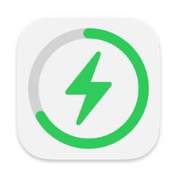
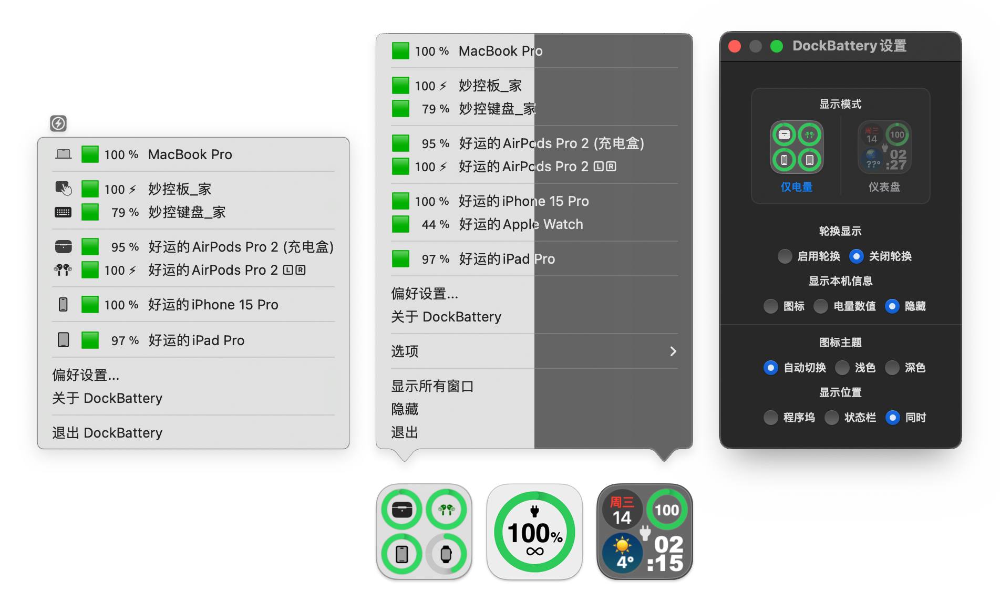

# 
<p align="center">

<h1 align="center">DockBattery</h1>
<h3 align="center">Get battery info of all your devices on Mac and display it on the Dock!<br><a href="./README.md">[中文版本]</a></h3> 
</p>

## Screenshots
<p align="center">
 
</p>

## Installation and Usage
### Installation:
Download the latest installation file [here](../../releases/latest) or install via Homebrew:  

```bash
brew install lihaoyun6/tap/dockbattery
```

### Usage: 
- No configuration is required. DockBattery will automatically search for all supported devices after startup.  
- You can right-click on the Dock icon to display the battery info of your other devices.  
- In preferences, you can also switch the Dock icon theme to display more information that suits your needs.  
- After expanding the right-click menu, holding down the <kbd>Option</kbd> key will display the last time each device updated its battery level.  

## Q&A
**1. Why isn't my iPhone/iPad displayed?**
> Please make sure your iPhone/iPad has trusted this Mac and turned on WiFi sync. And make sure it is in the same LAN as the Mac.  

**2. Does my Apple Watch need to be pre-connected?**
> No, once DockBattery detects your iPhone, it will automatically read the battery information of the Apple Watch paired with it.  

**3. Why do some device name have a ⚠️?**
> If this symbol appears, it means that the device has not updated its battery information for more than ten minutes, and may be offline or turned off.  

**4. Can it read the battery of an iPhone not connected to Wi-Fi?**
> In theory, yes. Related functionality will be added in future versions, stay tuned.  

**5. Why does DockBattery need Bluetooth permission?**
> DockBattery needs Bluetooth to capture packets from peripheral devices in order to parse their battery information.  

**6. Why does DockBattery need location permission?**
> DockBattery supports displaying local weather in the "Dashboard" view mode, which requires obtaining the user's location to function properly.

## Thanks
[libimobiledevice](https://github.com/libimobiledevice/libimobiledevice) @libimobiledevice  
> This project uses executable files and runtime libraries compiled from libimobiledevice based on version `73b6fd1`. Feel free to compile and replace them if in doubt.

[comptest](https://gist.github.com/nikias/ebc6e975dc908f3741af0f789c5b1088) @nikias  
> This project uses executable files compiled based on this source code. Feel free to compile and replace them if in doubt.  

[ChatGPT](https://chat.openai.com) @OpenAI  
> Some of the code in this project is generated or refactored by ChatGPT.
